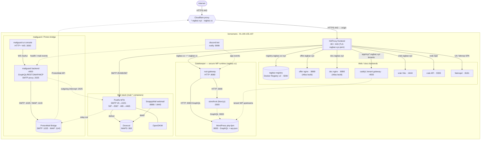

# Konsonans Topology

A map of what runs on the **konsonans** host (Oslo, `91.190.155.197`), the ports
each component listens on, the protocols in use, and how requests are routed.

- **Solid arrows** are confirmed routes (from the HAProxy config and the
  Compose files).
- **Dashed arrows** are *plausible* connections — intended or inferred dataflow
  that is not pinned to a single config line.

## Routing table (HAProxy `konsonans` frontend)

| Host / match | Backend | Target |
|---|---|---|
| `registry.ragbaz.cc` / `registry.ragbaz.xyz` | `ragbaz_registry` | `127.0.0.1:5000` |
| `ragbaz.cc` + `*.ragbaz.cc` | `secure_wp_backend` | `127.0.0.1:8080` (gatekeeper) |
| `app.ragbaz.xyz`, `my.ragbaz.xyz`, `*.ragbaz.xyz` | `app/wp/tenant_backend` | `127.0.0.1:4555` (caddy) |
| `vrak.ragbaz.xyz` + `/api/` | `vrakAPI` | `127.0.0.1:5555` |
| `vrak.ragbaz.xyz` | `vrak_app` | `127.0.0.1:4444` |
| `offer.ragbaz.xyz` | `offer_backend` | `127.0.0.1:8889` |
| `doc.ragbaz.xyz` | `doc_backend` | `127.0.0.1:8890` |
| User-Agent `fwknop` | `fwknop` | `127.0.0.1:8181` |
| SMTP `:25` / `:465` / `:587` | mail frontends | `:2225` / `:4465` / `:5587` |

The wildcard cert `ragbaz.xyz.pem` terminates TLS for every `*.ragbaz.xyz`
subdomain; DNS is Cloudflare-proxied to the konsonans origin.
