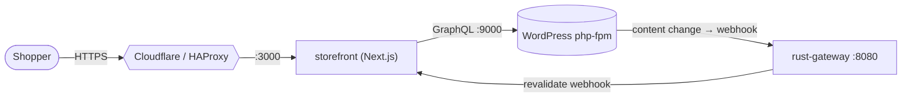

# Scenario C — Headless commerce storefront

The commerce face of the platform: a **Next.js storefront** that renders against
WordPress **GraphQL**, while WordPress stays purely editorial. It runs as part of
the [gatekeeper stack](./scenario-secure-wp.md) (Scenario B is its runtime
substrate).

## How it wires up



## Configuration (from `docker-compose.yml`)

| Env | Meaning |
|---|---|
| `WORDPRESS_API_URL=http://wordpress:9000/graphql` | GraphQL source of truth |
| `GATEKEEPER_HEALTH_URL=http://gateway:8080/healthz` | upstream health gate |
| `NEXT_PUBLIC_SITE_HOSTNAME` | public hostname (default `ragbaz.cc`) |
| `STOREFRONT_REVALIDATE_SECRET` | shared secret for on-publish revalidation |

When an editor publishes in WordPress, the gateway fires
`RAGBAZ_STOREFRONT_URL` (`http://storefront:3000`) with
`RAGBAZ_STOREFRONT_REVALIDATE_SECRET` so the storefront re-renders only the
changed paths (incremental revalidation).

## Run

```bash
cd products/articulate/gatekeeper
docker compose up -d --build storefront wordpress gateway
curl -s -o /dev/null -w "%{http_code}\n" http://127.0.0.1:3000/     # storefront
```

## Canonical vs parallel

`storefront` here (inside gatekeeper) is the runtime-attached shopfront. Note the
suite also carries `storefront-xtas` and `universe/main` as parallel/older
storefront lines — treat the gatekeeper `storefront` as the one wired to the
secure runtime, and the others as candidates to consolidate.
