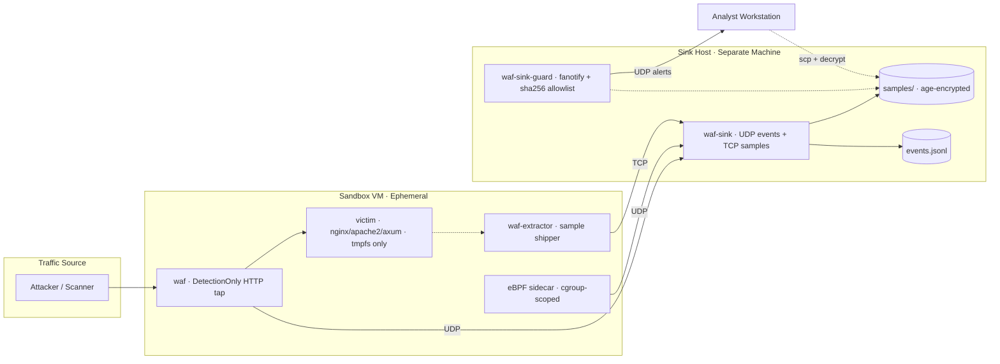

import Tabs from '@theme/Tabs';
import TabItem from '@theme/TabItem';

# DetCordon

**Path:** `products/detcordon` · **Lifecycle:** active prototype · **Rust workspace**

DetCordon is a **containment-first malware observation environment** — a deliberately isolated detonation sandbox for web malware (PHP webshells, HTTP-delivered exploits, scanner-driven RCE payloads). It observes hostile web traffic in a disposable sandbox, captures sample bodies, ships them one-way to a separate sink host, and stores them age-encrypted for offline analysis.

It does **not** block malware inline — attackers must "succeed" to be observed.

---

## Architecture

DetCordon is split across two physically separate hosts with a strict one-way data flow:



### Data flow

1. Attacker sends HTTP request to the **waf** tap (ModSecurity + OWASP CRS, DetectionOnly mode)
2. waf forwards the request to the **victim** — never blocks
3. Victim writes sample files to tmpfs (its only writable storage)
4. **waf-extractor** detects new files, ships them over TCP to the sink (write-only)
5. **waf** emits UDP JSON events with ModSec hits, headers, body
6. **waf-sink** receives events (UDP) and samples (TCP), age-encrypts samples, stores by sha256
7. **waf-sink-guard** monitors every write via fanotify, validates against sha256 allowlist
8. Analyst retrieves samples via scp, decrypts offline with age private key

---

## Crates

| Crate | Runs On | Purpose |
|-------|---------|---------|
| `waf` | Sandbox VM | HTTP reverse-proxy tap, DetectionOnly ModSec + CRS, UDP telemetry |
| `waf-extractor` | Sandbox VM | Watches victim tmpfs, ships samples over TCP (write-only) |
| `waf-sink` | Sink host | UDP event receiver + TCP sample receiver, age-encrypts, sha256 storage |
| `waf-sink-guard` | Sink host | fanotify write auditor + sha256 allowlist, alerts on unknown writes |
| `waf-vm-supervisor` | Sandbox host | Firecracker lifecycle manager with boot policy (cold/rootfs-reset/native-snapshot) |
| `waf-deploy` | Operator | ratatui TUI + headless CLI that generates deployment artifacts |
| `waf-broker` | Sink host | Multi-sensor heartbeat collector and status endpoint |
| `waf-ebpf` | Sandbox VM | Aya-based, cgroup-scoped telemetry sidecar (active development) |

### Deployment artifacts (`waf-deploy`)

<Tabs>
<TabItem value="docker" label="Docker Backend">

- `sandbox/docker-compose.yml` (waf + victim + extractor)
- `sandbox/apparmor/*.profile` (3 profiles)
- `sandbox/scripts/install-host-hardening.sh`
- `sandbox/ebpf/trace.bt` (bpftrace)
- `sink/systemd/waf-sink.service`, `waf-sink-guard.service`
- `sink/allowlist.txt`

</TabItem>
<TabItem value="firecracker" label="Firecracker Backend">

- VM config + supervisor config
- Host scripts (network setup, start, teardown, warmup)
- systemd units (supervisor, waf service)
- nftables rules
- Rootfs overlay + bake/package/validate scripts
- Native snapshot create/restore/cleanup scripts

</TabItem>
</Tabs>

---

## Security model: 10 non-negotiable rules

| # | Rule | Rationale |
|---|------|-----------|
| 1 | Victim bind-mounts nothing from host | Sample bytes never touch the VM's real filesystem |
| 2 | Victim network `internal: true`, default-drop egress | Sandbox can't be used as a launchpad |
| 3 | WAF in `DetectionOnly` | Malware must succeed to be observed |
| 4 | Samples leave write-only (TCP), events leave UDP | No inbound channel for C2 |
| 5 | Sink stores `samples/<sha256>`, mode `0400`, no extension | Prevents accidental execution |
| 6 | Sink-guard always-on with up-to-date allowlist | Unknown write on sink = incident |
| 7 | eBPF host-pid is opt-in; default cgroup-scoped | Bounds sidecar blast radius |
| 8 | Time-boxed (default 30 min) | Limits blast radius |
| 9 | Sample bytes never over UDP | UDP loss acceptable only for events |
| 10 | Sink host ≠ sandbox host (different machine) | Kernel isolation |

---

## Why no kernel module

The project deliberately avoids out-of-tree kernel modules. Everything is in-kernel behind safer interfaces:

| Goal | Mechanism |
|------|-----------|
| Observe syscalls | eBPF tracepoints / fentry |
| Observe file writes | eBPF `vfs_write` / fanotify |
| Observe exec'd processes | eBPF `sched_process_exec` |
| Observe outbound sockets | eBPF `tcp_connect` |
| Block syscalls | BPF LSM (kernel ≥5.7) or seccomp |
| Capability stripping | `cap_drop: [ALL]`, seccomp default |
| File constraints | AppArmor |
| Network containment | netns + nftables default-drop |
| Strong isolation | gVisor / Kata / Firecracker (runtime swap) |

---

## Build and run

```bash
# Build workspace
cargo build --release

# Run all tests
cargo test --workspace

# Generate deployment artifacts (TUI)
cargo run -p waf-deploy

# Headless artifact generation
cargo run -p waf-deploy -- --backend firecracker --dry-run

# Run the HTTP tap
SINK_ADDR=<ip>:5514 UPSTREAM=http://... cargo run -p waf

# Run the sink
cargo run -p waf-sink -- --recipient age1...

# Run the guard (needs root)
sudo cargo run -p waf-sink-guard -- --watch /var/lib/waf-sink

# Run the VM supervisor
cargo run -p waf-vm-supervisor -- --plan
```

**Prerequisites:** `libmodsecurity3`, `libmodsecurity-dev`, `pkg-config`, Rust 2021 edition.

---

## Roadmap

| Stream | Status |
|--------|--------|
| Docker backend (compose + AppArmor + bpftrace) | Implemented |
| `waf-extractor` sample shipper | Implemented |
| `waf-sink-guard` (fanotify + allowlist) | Implemented |
| `waf-deploy` ratatui TUI | Implemented |
| Firecracker backend (VM lifecycle + snapshot/reset) | Implemented; base-image polish remains |
| Honeypot mode and sensor broker | Implemented |
| Aya eBPF (Rust bpftrace replacement) | In progress |
| gVisor runtime option | Planned |

---

## Commercial position

> Strongest standalone non-Articulate product candidate in `/data/src`.

Estimated total business value: **$0.80M–$2.50M** (medium confidence).

| Feature Group | Share | Value |
|---------------|-------|-------|
| Sandbox tap + detection telemetry | 35% | $0.28M–$0.88M |
| Sample extraction + sink + integrity guard | 40% | $0.32M–$1.00M |
| Deploy TUI + containment automation | 25% | $0.20M–$0.63M |

Best capitalization: produce one pilot-ready story — "stand up a contained web-malware detonation lane in a day."

**[Request a pilot →](mailto:sales@ragbaz.cc?subject=DetCordon%20pilot%20request)**

---

## Further reading

- [DetCordon prospectus](pathname:///prospectus/detcordon.html) — buyer-facing positioning and packaging snapshot
- [Containment assurance](/products/detcordon/containment-assurance) — reviewer checklist mapping every non-negotiable containment rule to implementation evidence
- [Buyer demo runbook](/products/detcordon/buyer-demo-runbook) — the repeatable, synthetic-only demo path with expected output and failure triage
- [Performance & overhead review](/products/detcordon/performance-review) — measured request overhead against a plain WordPress origin and against gatekeeper, with resource-consumption breakdowns

- `AGENTS.md` — full architecture, environment variables, coordination protocol
- `doc/architecture.md` — topology diagrams, dataflow, crate maps
- `doc/firecracker-plan.md` — Firecracker backend implementation plan
- `doc/presentation.html` — impress.js slide deck
- `ragbaz.component.json` — RAGBAZ component manifest with capabilities, config knobs, security model
