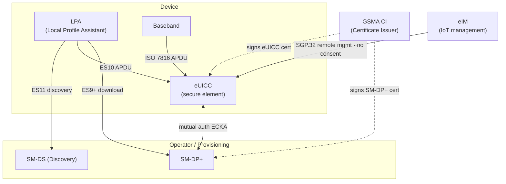
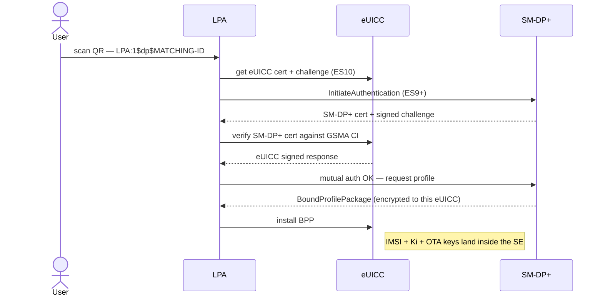
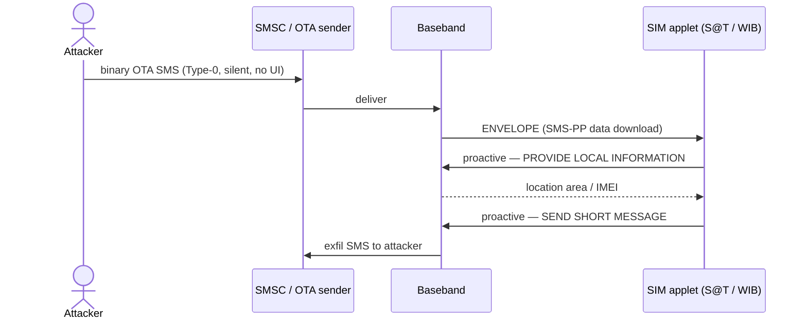
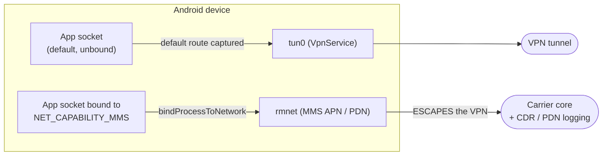
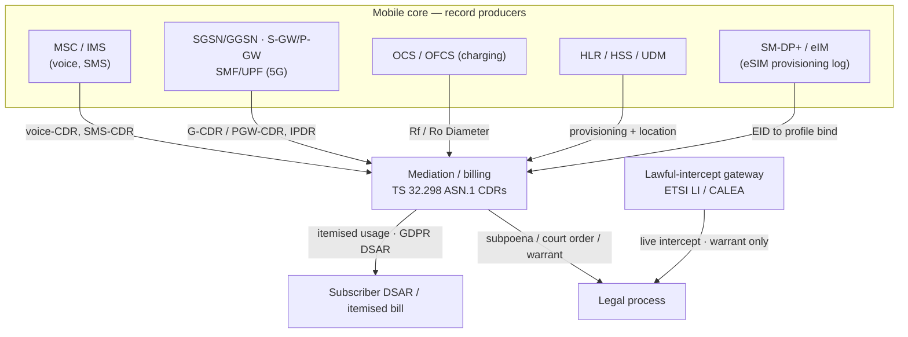
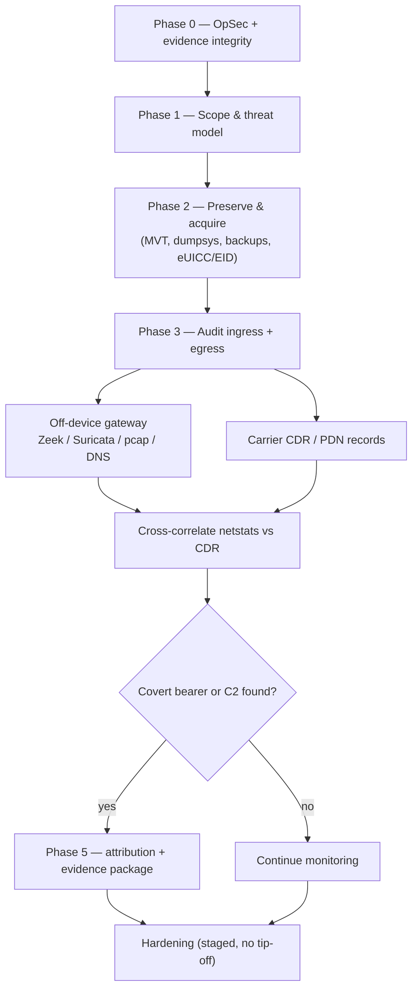

import { TrustExplorer, LostSimExplorer, SenderVerify, VpnBypass, RecordRoutePlanner } from '@site/src/components/CellularWidgets';

<Hero
  marque="SCHOOL · CELLULAR"
  tagline="field reference"
  title="Mobile Subscriber-Identity Security"
  subtitle="SIM · eSIM / RSP · messaging · covert channels"
  lede="The attack surface of mobile subscriber identity: the physical SIM, the embedded eUICC and its remote provisioning, the (non-)verifiability of SMS/MMS origin, the covert paths that bypass an on-device VPN — and a DFIR playbook closing on the carrier records that on-device tampering cannot reach."
/>

:::note reflowed to RAGBAZ
This started life as a standalone Tufte-CSS artifact whose one margin note lamented that it *"could not find a published ragbaz design system to conform to."* It now has one: reflowed onto the RAGBAZ docs system — native headings, `Admonition`/`Callout`/`SpecTable` components, and the eight PlantUML figures re-drawn as inline Mermaid so nothing is uploaded to a public render server.
:::

> The secret key is engineered never to leave the secure element — so real-world key theft reduces to exploiting a weak legacy algorithm or physically attacking the chip. Every layer here is a variation on that one boundary.

<Admonition type="warning" title="SCOPE & ETHICS">
Material here is for defensive analysis, authorised testing, and evidence-grade investigation. Offensive mechanisms are described at the level needed to <em>detect</em> and <em>attribute</em> them, not to operate them covertly. Nothing here is a technique for obtaining another person's records without their consent or due process.
</Admonition>

## 1 · The layered trust model

Everything reduces to one root of trust. The GSMA **CI** (Certificate Issuer) signs both the eUICC's per-chip certificate and each **SM-DP+**'s certificate; profile delivery is a mutual authentication plus an ECKA key agreement. Break *either* half — steal an eUICC private key, or an SM-DP+ certificate — and the "end-to-end encrypted profile" guarantee collapses.

**Figure 1** — RSP / eSIM trust model. The GSMA CI is the single root of trust; compromising either the eUICC private key or an SM-DP+ certificate defeats one half of the mutual authentication.



<TrustExplorer />

## 2 · The physical SIM (UICC)

Authentication runs *on-card*: the baseband sends a challenge, the card computes the response and session keys internally, and returns only the result. On the **APDU** bus you therefore see IMSI, the challenge/response pair, and the derived CK/IK session keys — never **Ki**, the per-subscriber master key.

**Figure 2** — On-card authentication over the ISO 7816 APDU bus. Session keys travel; the master key Ki never does.

```mermaid
sequenceDiagram
  participant BB as Baseband (master)
  participant SIM as UICC / USIM (SE)
  BB->>SIM: AUTHENTICATE(RAND, AUTN)
  Note right of SIM: Milenage / COMP128 runs on-card; Ki never exported
  SIM-->>BB: RES, CK, IK (derived session keys)
  Note over BB,SIM: On the wire — RAND, RES, CK/IK, IMSI, STK. Never — Ki, OTA keys.
```

What a lost card actually leaks depends almost entirely on whether a SIM PIN is set. With it enabled the card is inert on power-up; without it, stored identifiers and — more dangerously — the ability to receive the subscriber's calls and SMS one-time codes pass to whoever holds it.

<LostSimExplorer />

## 3 · eSIM and Remote SIM Provisioning

The **eUICC** is a soldered secure element provisioned over the air. The **LPA** parses an activation code and relays an encrypted **BPP** that only the target eUICC can decrypt — which is why you cannot extract your own profile through the LPA, and why the interesting attacks target the chip or the provisioning server instead.

**Figure 3** — SGP.22 consumer profile download. The LPA relays only ciphertext; secrets land inside the secure element.



The 2025 **Kigen eUICC** disclosure showed the systemic risk: a publicly-keyed GSMA **TS.48** test profile let researchers load an applet, an incomplete on-card Java Card bytecode verifier let it escape the firewall, and the eUICC's private key plus GSMA certificate were extracted — enough to download real profiles in cleartext and clone eSIMs.

<Steps>
  <div><Badge color="gray">2019</Badge> &nbsp;Simjacker / WIBattack (S@T &amp; WIB applet abuse) and prior Java Card research surface.</div>
  <div><Badge color="yellow">Mar 2025</Badge> &nbsp;Security Explorations extracts an eUICC private ECC key; proof delivered to Kigen.</div>
  <div><Badge color="orange">Jul 2025</Badge> &nbsp;Public disclosure; GSMA TS.48 v7.0 restricts test-profile capability; vendor OS patch hardens the verifier.</div>
  <div><Badge color="red">2025 →</Badge> &nbsp;Residual exposure concentrated in un-updated IoT/M2M eUICCs and SGP.32 management (an eIM with no user-consent gate).</div>
</Steps>

## 4 · STK / OTA — the Simjacker family

Because the card cannot speak first on the master-driven bus, it raises a status word and the handset `FETCH`es a proactive command. A silent binary OTA SMS delivered via `ENVELOPE` reaches a vulnerable applet, which can request location and send an SMS — the Simjacker mechanism. It is largely mitigated by removing S@T/WIB applets and filtering binary OTA SMS at the network.

**Figure 4** — Simjacker / WIBattack via a legacy S@T/WIB applet, driven by a silent binary OTA SMS.



## 5 · SMS / MMS origin: nothing the handset can verify

An inbound SMS hands the app a spoofable sender string (`TP-OA`), an unreliable SMSC address, and a timestamp — no origin-network attestation, no signature. MMS is no better: across carriers it travels as email (**MM4**), the `From:` is a header written by the sender side, and no DKIM/SPF/DMARC is enforced across the inter-operator mesh.

**Figure 5** — Inter-carrier MMS is SMTP/MIME (MM4). The originator is a header — email-grade spoofable across GRX/IPX.

```mermaid
sequenceDiagram
  participant A as Originating MMSC (A)
  participant B as Terminating MMSC (B)
  participant R as Recipient handset
  A->>B: SMTP MAIL FROM +15550000/TYPE=PLMN@mmsc.a
  A->>B: RCPT TO +15554321/TYPE=PLMN@mmsc.b
  A->>B: DATA — X-Mms-Message-Type MM4_forward.REQ, From header
  B-->>A: MM4_forward.RES
  B->>R: MM1 M-Retrieve.conf (From = asserted originator)
  Note over A,B: From is a sender-written header; no DKIM/SPF/DMARC across GRX/IPX
```

<SenderVerify />

## 6 · Covert bearers that bypass an on-device VPN

Android's VPN is an L3 capture of the *default* network. A socket explicitly bound to a specific network — e.g. the MMS **PDN** via `NET_CAPABILITY_MMS` and `bindProcessToNetwork` — pins to that interface and escapes the tunnel, even under "always-on + block without VPN". The forensic backstop is that the carrier still logs the PDN activation and bytes in its **CDR**s, regardless of on-device state.

**Figure 6** — A socket bound to the MMS PDN escapes an on-device VPN. Carrier CDRs remain the forensic backstop.



<VpnBypass />

## 7 · Obtaining carrier records: routes and provenance

Every preceding section leans on the same backstop: the carrier holds records the handset cannot reach or forge. But "the CDR proves it" is only useful if you can *lawfully obtain* the CDR. There are three access routes, and which records you can get depends entirely on *who you are* and *what authority you hold* — not on what the network technically logs.

**Figure 7** — Record provenance and access routes. Each core network function emits a charging record; mediation normalises them to TS 32.298 CDRs, which reach you as a subscriber DSAR/bill or through legal process, with live intercept gated behind a warrant.



### 7.1 · The three lawful routes

**As the subscriber** you already own most of the low-resolution data: an *itemised bill* lists calls, SMS counts and per-session data volume, and a **DSAR** (GDPR Art. 15, CCPA and analogues) compels the fuller personal-data set the operator retains — usage records, provisioning history, and often coarse cell/location associated with billing. This is self-service and needs no court. **As an enterprise or plan owner** (a business account, an MDM/EMM fleet, a family-plan admin) you can request the records for numbers on the account through the carrier's business portal or account team. **As law enforcement** the resolution rises with the legal instrument: a *preservation letter* first freezes the data before it ages out; a *subpoena* reaches subscriber and toll (CDR) records; a *court order* reaches transactional/PDN and historical cell-site; a *warrant* is required for content and for real-time lawful intercept. Cross-border, an **MLAT** / mutual-legal-assistance request bridges to the foreign operator.

<Callout title="AUTHORITY GATES RESOLUTION" accent="yellow">
A subscriber DSAR and a warrant can target the same switch, but return very different granularity. Nothing here obtains another person's records without their consent or due process — that is the line between an investigation and an offence.
</Callout>

### 7.2 · What each record is, and where it is born

A "CDR" is not one thing. Each network function emits its own charging record (3GPP TS 32.240 framework, TS 32.298 ASN.1 BER encoding), which a **mediation** system normalises, correlates and hands to billing, retention or a warrant return:

<SpecTable rows={[
  ["voice / SMS-CDR", "MSC / IMS", "A/B-number, IMSI, IMEI(SV), start/duration, serving Cell-ID / ECGI at setup"],
  ["S-CDR / G-CDR", "3G SGSN / GGSN", "APN, PDN activation/deactivation, byte counts up/down, allocated (CGNATed) IP"],
  ["SGW-CDR / PGW-CDR", "4G EPC", "same, per EPS bearer — the PDN backstop from section 6"],
  ["SMF / UPF records", "5G core", "same, per QoS flow"],
  ["IPDR", "packet gw / probe", "finer 5-tuple flow logs kept beyond the PGW/SMF volume totals; shorter retention"],
  ["Ro / Rf events", "OCS / OFCS", "Diameter online (prepaid) / offline (postpaid) charging stream; cross-checks the billed CDR"],
  ["identity binding", "HLR / HSS / UDM", "IMSI to MSISDN to IMEI, current VLR / serving node, provisioning history"],
  ["provisioning", "SM-DP+ / eIM", "EID to profile download log for eSIMs"],
  ["location", "RAN + core", "serving cell to historical cell-site to tower dump to timing-advance / RTT / RF-fingerprint"],
]} />

### 7.3 · Retention, format, and the practical ask

Records do not live forever. Retention is set by national law and operator policy — commonly months to a couple of years for CDRs, often much shorter for fine IPDR/flow data — which is why the *preservation request goes first*, before the subpoena that eventually compels production. What you receive is typically a mediation export (CSV/PDF for a bill or DSAR; native TS 32.298 ASN.1 BER, or a vendor CSV, for a warrant return). For an investigation the high-value, concrete ask is: *the PGW/SMF PDN-session records and voice/SMS CDRs for this IMSI/MSISDN over this window, with serving-cell and byte counts, plus the IMEI binding history and any eSIM provisioning events* — then correlate those against on-device `netstats` exactly as in the playbook below.

<RecordRoutePlanner />

## 8 · DFIR playbook for a suspected repeat compromise

When prior defences have already failed, assume a persistent, adaptive adversary at a layer those defences never covered. Preserve evidence and operate over a clean out-of-band channel *before* touching anything; audit device egress and carrier records *in parallel*; cross-correlate on-device `netstats` against carrier CDRs to reveal covert bearers; and stage hardening so you do not tip the adversary.

**Figure 8** — DFIR playbook: preserve first, audit device egress and carrier records in parallel, cross-correlate, then harden without tipping the adversary.



The single highest-signal cross-check is **on-device per-UID/per-interface byte counts versus carrier-reported usage**: any excess the operator recorded that the device does not account for points at a covert bearer or tampering. Because carrier records are outside the device, complete on-device concealment is not achievable — which is exactly what makes an evidence-grade investigation possible.

## Glossary

<KeyVal rows={[
  ["SIM / UICC", "Subscriber Identity Module; the smartcard (Universal Integrated Circuit Card) holding subscriber credentials and running the USIM application."],
  ["Ki", "Per-subscriber 128-bit authentication master key shared with the operator's HLR/HSS. Used on-card by COMP128 (legacy) or Milenage/TUAK (modern); never leaves the card."],
  ["eUICC / eSIM", "Embedded UICC: a soldered secure element provisioned remotely. Identified by a 32-digit EID whose prefix encodes the manufacturer (EUM)."],
  ["RSP", "Remote SIM Provisioning. Consumer variant SGP.22 (pull, user consent); IoT variant SGP.32 (managed by an eIM, no consent gate)."],
  ["LPA", "Local Profile Assistant: parses activation codes (LPA:1$dp$matchingID), talks ES9+ to the SM-DP+ and ES10 to the eUICC. Relays ciphertext only."],
  ["SM-DP+ / SM-DS", "Subscription Manager Data Preparation (prepares/delivers profiles) and Discovery Server. Both hold GSMA-CI-signed certificates."],
  ["BPP", "Bound Profile Package: the profile encrypted end-to-end to one specific eUICC, so intercepting it yields chip-bound ciphertext."],
  ["STK / OTA", "SIM Application Toolkit; proactive commands fetched by the handset. OTA = Over-The-Air management via binary SMS (ENVELOPE SMS-PP) — the Simjacker delivery path."],
  ["IMSI", "International Mobile Subscriber Identity: the permanent subscriber ID stored in clear on the card (concealed over-air in 5G via SUCI)."],
  ["APDU", "Application Protocol Data Unit: the ISO 7816 command/response format on the SIM-to-baseband line. Carries RAND/RES, CK/IK, IMSI, STK — never Ki."],
  ["MM4", "Inter-MMSC interface (3GPP TS 23.140): SMTP/MIME with X-Mms-* headers, MSISDNs as +E164/TYPE=PLMN@mmsc addresses, over private GRX/IPX."],
  ["MMSC / MMS", "Multimedia Messaging Service Centre; MMS payload is an HTTP POST to the MMSC, notified via WAP-push SMS. Sender field is not handset-verifiable."],
  ["PDN / APN", "Packet Data Network context bound to an Access Point Name. A device can hold several concurrently (default, MMS, IMS) subject to baseband multi-PDN support."],
  ["CDR", "Call Detail Record: carrier-side log of calls, messages, PDN activations and data volume — the forensic backstop on-device tampering cannot reach."],
  ["CDR types", "Per-node records under TS 32.240, encoded per TS 32.298 (ASN.1 BER): voice/SMS-CDR (MSC/IMS); S-CDR/G-CDR (3G); SGW/PGW-CDR (4G EPC); SMF/UPF (5G)."],
  ["IPDR", "IP Detail Record: finer flow/session log (5-tuples, timestamps) some operators keep beyond CDR volume totals. Shorter retention than billed CDRs."],
  ["OCS / OFCS", "Online (prepaid, real-time credit) and Offline (postpaid) Charging Systems. Carry Diameter Ro/Rf event streams that cross-check the billed CDR."],
  ["DSAR", "Data Subject Access Request (GDPR Art. 15, CCPA analogues): the subscriber compels disclosure of the personal data an operator holds. Self-service, no court order."],
  ["Lawful intercept", "Standardised real-time interception at the operator (ETSI LI in Europe, CALEA in the US). Warrant-gated; delivers content and live signalling."],
  ["MLAT / MLA", "Mutual Legal Assistance Treaty/request: the cross-border channel by which authorities obtain records held by a foreign operator."],
  ["DFIR", "Digital Forensics and Incident Response. Mobile toolset: MVT, dumpsys/bugreport, Zeek/Suricata, and carrier-record correlation."],
  ["RCS / RBM", "Rich Communication Services; RCS Business Messaging adds a verified sender (brand, logo, checkmark) authenticated by the carrier/Google backend."],
]} />
